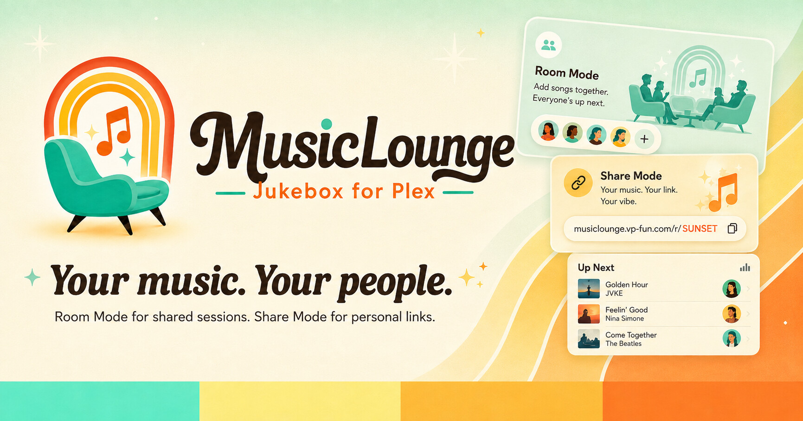

<p align="center">
  
</p>

# MusicLounge Jukebox for Plex

A self-hosted jukebox for your Plex music library — from the makers of
[MusicMind for Plex](https://musicmind.vp-fun.com/) and
[RiderMusic](https://ridermusic.vp-fun.com/).

Two ways to share your library: **Room Mode**, a shared queue people join
with a code and DJ together in real time, and **Share Mode**, a private
link to a single album, playlist, or artist that one person streams on
their own schedule. No login, no app install, either way.

**Status: scoped, in active development.** See
[`MUSICLOUNGE-SCOPE.md`](./MUSICLOUNGE-SCOPE.md) for the full design.

## How it works

```
Room Mode:   Guests (join code) -> shared queue -> one "now playing" -> host's device -> speakers
Share Mode:  Recipient -> /linked/<token> -> their own <audio> element, independent playback
                                |
                                v
                          Plex Media Server
```

- **Room Mode:** a host starts a session, guests join via code, everyone
  searches and queues from the library, one authoritative "now playing"
  drives every joined device.
- **Share Mode:** a host picks an album, playlist, or artist and mints a
  time-limited link (24/48/72 hours). The recipient opens `/linked/<token>`
  — a locked, single-item player, nothing else in the library exposed.
- Both modes proxy audio server-side, so the real Plex token never
  reaches a client browser.

## Requirements

- A Plex Media Server with a music library
- A way to expose the app to the internet — guests and share-link
  recipients both need to reach it from outside your home network. See
  "Exposing it to the internet" below.
- Docker (recommended), or Python 3.12+ for a manual install
- An SMTP relay, if you want Share Mode to email links (links are also
  always copyable directly, independent of email)

## Setup

### Docker (recommended)

```bash
git clone https://github.com/earthmonkey419/musiclounge.git
cd musiclounge

cp config.example.py config.py
# edit config.py: PLEX_URL, PLEX_TOKEN, MUSIC_LIB, ADMIN_PASSWORD, SMTP_*
# set COOKIE_SECURE = True (requires HTTPS — see below)
# for Docker specifically, also set DB_PATH = "/app/data/musiclounge.db"
# — the volume below only persists /app/data, and DB_PATH defaults to a
# bare filename in the app root, which the container recreates fresh
# every time unless you point it at the mounted directory

docker build -t musiclounge .
docker run -d --name musiclounge \
  -p 8679:8679 \
  -v $(pwd)/config.py:/app/config.py:ro \
  -v musiclounge-data:/app/data \
  musiclounge
```

`config.py` holds your Plex token, admin password, and SMTP credentials —
it's bind-mounted at container start, never baked into the image
(`.dockerignore` excludes it from the build context too, as a second
layer of protection), so it never ends up in a Docker layer or gets
pushed anywhere by accident.

`musiclounge-data` is a named volume for the SQLite database (room
sessions, queue, and share links) so it survives container recreation —
**only works if `DB_PATH` in your `config.py` actually points inside
that mounted directory** (`/app/data/musiclounge.db`), per the note
above. Worth knowing this if you're comparing against RiderMusic's
docker run command, which doesn't persist a data volume the same way.

### Manual (Python)

```bash
git clone https://github.com/earthmonkey419/musiclounge.git
cd musiclounge
python3.12 -m venv .venv
source .venv/bin/activate
pip install -r requirements.txt

cp config.example.py config.py
# edit config.py as above

python init_db.py
python app.py
```

App runs on port `8679` by default — chosen specifically because port
`8788` was already taken by another service on the NAS this was
originally built on. Check that `8679` is actually free on your own
box before relying on it; RiderMusic's own default is a different
port (`6869`) by its own separate design, not because of any
collision.

**Before real use:** `COOKIE_SECURE` must be `True`, which requires the
app to be served over HTTPS. `False` is for local development only.

**Getting a real Plex token:** see
[Plex's own guide](https://support.plex.tv/articles/204059436-finding-an-authentication-token-x-plex-token/).

### Using Portainer

Portainer can manage the container, but creating config.py the first
time still needs one-time access to the host filesystem (SSH or File
Station) — Portainer has no built-in way to author a new file from
scratch.

1. One-time setup, outside Portainer: SSH in and run
   cd /path/to/musiclounge
   cp config.example.py config.py
   Then edit config.py with your real PLEX_URL, PLEX_TOKEN, MUSIC_LIB,
   ADMIN_PASSWORD, and SMTP_* values.
2. In Portainer, go to Stacks then Add stack.
   Repository method (recommended): paste
   https://github.com/earthmonkey419/musiclounge.git as the
   repository URL, leave the compose path as docker-compose.yml,
   and deploy. Portainer builds the image automatically.
   Web editor method: paste the contents of docker-compose.yml
   directly instead, if you'd rather not have Portainer pull from
   GitHub itself.
3. Once deployed, the app is reachable at http://your-host:8679.

## Exposing it to the internet

Both Room Mode guests and Share Mode recipients need to reach the app
from outside your home network.

**Cloudflare Tunnel is the tested, recommended path** (same as RiderMusic
and MusicMind). Broad steps, assuming you already have a domain on
Cloudflare:

1. In the Cloudflare Zero Trust dashboard, create a tunnel (or reuse an
   existing one if you're already running other services through
   Cloudflare)
2. Add a **Public Hostname** — pick a subdomain, and set the **Service
   URL** to `http://localhost:8679` (or whatever host/port MusicLounge is
   actually running on)
3. **Leave the Path field completely empty.** Setting it to something
   specific (e.g. testing `/admin/dashboard` first and forgetting to
   widen it) silently restricts routing to only that exact path — every
   other route (`/join`, `/guest`, `/linked/<token>`, static assets)
   will 404 even though the app itself is working fine. An empty Path
   routes the whole domain through.
4. Set `COOKIE_SECURE = True` in `config.py` and restart the app —
   Cloudflare terminates HTTPS at its edge, so cookies marked `Secure`
   will work correctly once traffic is genuinely coming through the
   tunnel's HTTPS endpoint.

## License

MIT
